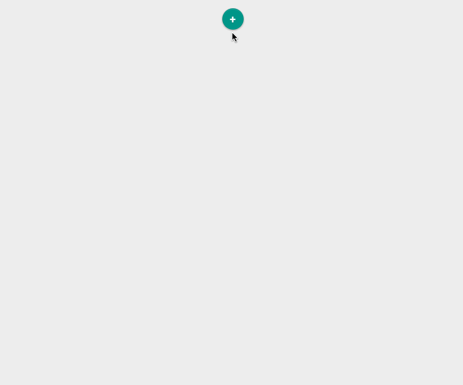

[](https://npmjs.org/package/colonel-kurtz)

---

A block based content editor powered by
[React](http://facebook.github.io/react/). Colonel Kurtz provides a
front-end for building pages as a series of blocks, serializing to a
JSON data structure.

---

[](https://travis-ci.org/vigetlabs/colonel-kurtz)
[](https://coveralls.io/r/vigetlabs/colonel-kurtz)

---

# Colonel Kurtz

Colonel Kurtz is a content editor written in
[React](http://facebook.github.io/react/). It forces content to be
broken up into individual types, such as a photo or chunk of text, and
provides a user interface for managing those "blocks" of content,
reordering them, and even nesting them inside other content.



Comprehensive documentation can be found under the [`./docs`](https://github.com/vigetlabs/colonel-kurtz/tree/master/docs) directory
of this repo. However the content that follows should provide a high
level overview:

## Data format

Colonel Kurtz can be serialized down to JSON. This structure looks like:

```json
[
  {
    "blocks": [],
    "content": {
      "html": "<p>This is introductory text.<br></p>",
      "text": "This is introductory text."
    },
    "type": "medium"
  },
  {
    "blocks": [
      {
        "blocks": [],
        "content": {
          "src": "http://fizbuz.com/image.jpg"
        },
        "type": "image"
      },
      {
        "blocks": [],
        "content": {
          "html": "<p>Sweet, sweet content.<br></p>",
          "text": "Sweet, sweet content."
        },
        "type": "medium"
      }
    ],
    "type": "section"
  },
  {
    "blocks": [],
    "content": {
      "html": "<p>This is footer text.<br></p>",
      "text": "This is footer text."
    },
    "type": "medium"
  }
]
```

A block has three important pieces of information:

1. **content**: A map of information captured about a block. This
could be display settings, rich text, etc.
2. **type**: Blocks are created within a given block type (more on
   this later). This block type has an identifier which is stored at
   this key (type). This is used to communicate how content should be
   displayed and how the editor should expose the content for
   modification.
3. **blocks**: A block can have child blocks, stored as an array. The structure of child
   blocks is exactly the same as top-level blocks.

## Configuring

More thorough documentation can be found at
[`./docs/colonel.md`](https://github.com/vigetlabs/colonel-kurtz/blob/master/docs/colonel.md)
however at a high level, Colonel Kurtz is installed with code loosely following:

```javascript
var ColonelKurtz = require('colonel-kurtz');

var container = document.querySelector("#container")
var input     = document.querySelector("#input")

var editor = new ColonelKurtz({
  el         : container,
  blocks     : JSON.parse(input.value),
  blockTypes : [{
    id: 'a-block',
    label: 'This is a block',
    component: require('./path/to/react/component')
  }]
});
```

***

<a href="http://code.viget.com">
  
</a>

Visit [code.viget.com](http://code.viget.com) to see more projects from [Viget.](https://viget.com)
